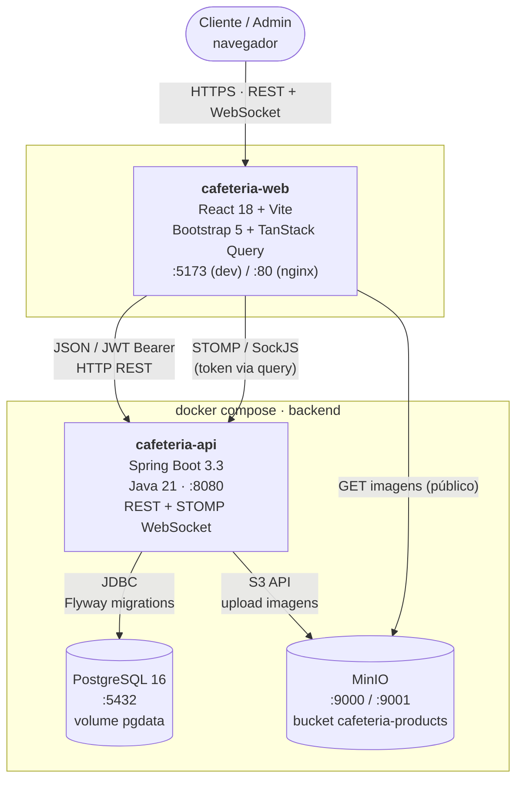
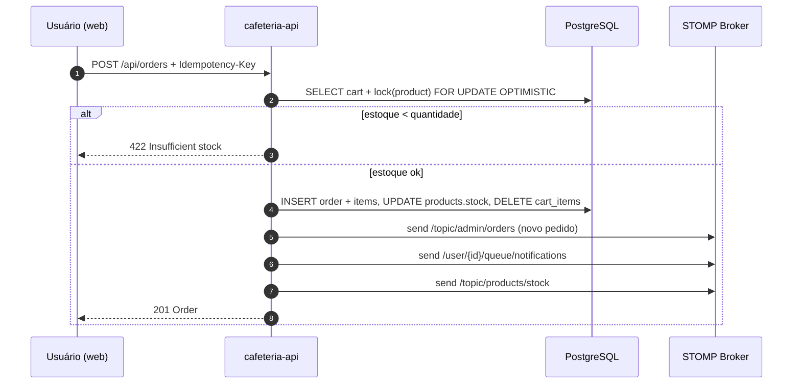
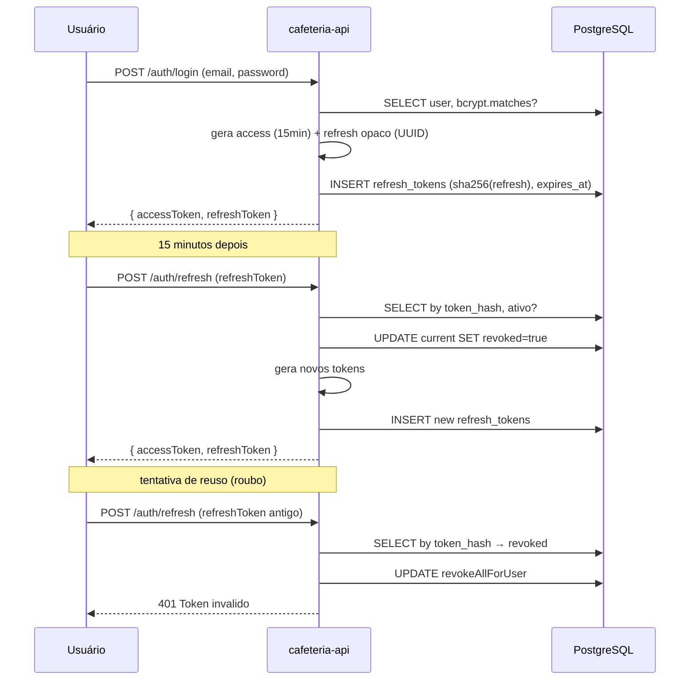

# Arquitetura — C4 Level 2 (Container)

## Containers

### cafeteria-web (frontend, repositório separado)
React 18 + Vite + TypeScript. Faz REST via Axios (interceptors anexam JWT, refresh automático em 401) e WebSocket via `@stomp/stompjs` + SockJS.

### cafeteria-api (este repositório)
Spring Boot 3.3:
- **Camada de apresentação**: REST controllers + STOMP controllers
- **Camada de aplicação**: services com regras de negócio, mappers MapStruct
- **Camada de domínio**: entities JPA + repositories Spring Data
- **Cross-cutting**: SecurityFilterChain com `JwtAuthFilter`, `GlobalExceptionHandler` (RFC 7807), `TraceIdFilter` (MDC), `Bucket4j` rate limit

### PostgreSQL 16
Schema versionado via Flyway (V1..V6). Tabelas com UUIDs, índices em colunas de filtro, locks otimistas em `products` e `orders`.

### MinIO
Storage S3-compatível para imagens. Bucket `cafeteria-products` com policy de download anônimo (URLs públicas servidas direto pra o navegador). `minio-init` cria o bucket no `docker compose up`.

## Fluxo de criação de pedido

## Fluxo de autenticação JWT com rotação de refresh token

