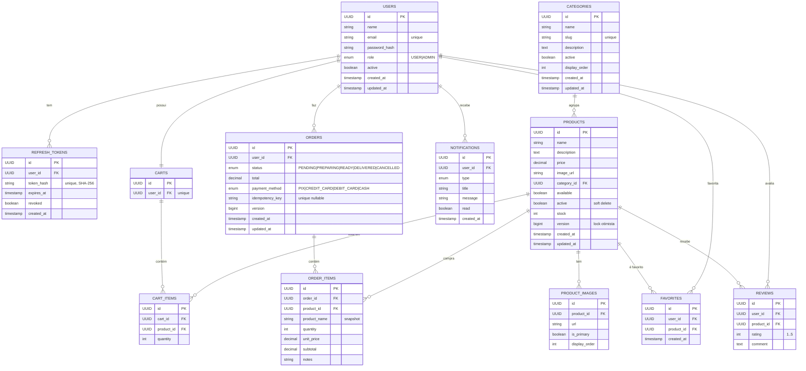

# Diagrama ER — Cafeteria

## Notas de modelagem

- **PKs em UUID** para evitar enumeração e facilitar integração distribuída futura.
- **Soft delete em `products`** (campo `active`) para preservar histórico em `order_items`. Order items guardam `product_name` como snapshot — nome do produto na hora da compra não muda quando o admin edita depois.
- **Lock otimista** em `products.version`: dois pedidos concorrentes pro mesmo produto não corrompem o estoque.
- **Idempotência**: `orders.idempotency_key UNIQUE` (nullable). Frontend pode enviar header `Idempotency-Key` para evitar double-submit no checkout.
- **Refresh tokens versionados**: token_hash com SHA-256 do token opaco. Quando rotacionamos, o anterior é marcado `revoked=true`; tentativa de reuso revoga toda a árvore (proteção contra roubo).
- **Constraints UNIQUE compostas**: `(user_id, product_id)` em `favorites` e `reviews` garantem regras de domínio direto no banco.
