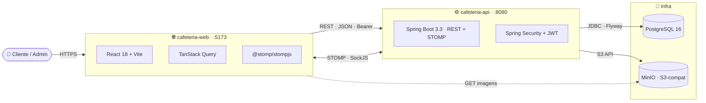

# ☕ Café & Grão · Cafeteria fullstack

> Trabalho final de **Desenvolvimento Web** — uma aplicação completa de cafeteria artesanal com catálogo público, carrinho, checkout, painel administrativo e atualizações em tempo real.

[]()
[]()
[]()
[]()
[]()
[]()

---

## 📑 Sumário

- [Visão geral](#-visão-geral)
- [Arquitetura](#-arquitetura)
- [Stack](#-stack)
- [Estrutura de pastas](#-estrutura-de-pastas)
- [Como rodar](#-como-rodar)
- [Credenciais e URLs](#-credenciais-e-urls)
- [Funcionalidades](#-funcionalidades)
- [Tempo real (WebSocket)](#-tempo-real-websocket)
- [Segurança](#-segurança)
- [Banco de dados](#-banco-de-dados)
- [Documentação detalhada](#-documentação-detalhada)
- [Critérios de avaliação](#-critérios-de-avaliação)

---

## 🎯 Visão geral

Aplicação **fullstack** composta por **dois repositórios independentes** lado a lado nesta pasta:

| Repo | Tecnologia | Responsabilidade |
|---|---|---|
| 📂 [`Backend/`](Backend/README.md) | Java 21 · Spring Boot 3.3 | REST API + segurança JWT + WebSocket STOMP + persistência |
| 📂 [`Frontend/`](Frontend/README.md) | React 18 · Vite · TypeScript | SPA com identidade visual "Café & Grão" |

Cada repo tem seu próprio `Dockerfile`, `docker-compose.yml`, `README.md`, `.env.example`, `.gitignore` e pode ser publicado/clonado independentemente.

---

## 🏗 Arquitetura



A separação em **camadas no backend** (Clean Architecture leve):

```
domain       → entidades JPA + repositories + enums
application  → services (regras de negócio) + DTOs + mappers MapStruct
presentation → controllers REST + endpoints STOMP
config       → security, websocket, openapi, minio, auditing
security     → JwtService, filters, UserDetails
exception    → GlobalExceptionHandler (RFC 7807) + custom exceptions
```

---

## 🛠 Stack

### Backend (`Backend/`)
- **Java 21** com Maven 3.9
- **Spring Boot 3.3** (Web, Security, Data JPA, Validation, WebSocket, Actuator)
- **PostgreSQL 16** + **Flyway** (6 migrations versionadas com seed)
- **JWT** (`jjwt`) + **BCrypt** strength 12
- **MapStruct** para Entity ↔ DTO
- **Lombok** para reduzir boilerplate
- **MinIO** (cliente S3) para upload de imagens
- **Bucket4j** para rate limit no login
- **SpringDoc OpenAPI** (Swagger UI)
- **JaCoCo** + **Testcontainers** (PostgreSQL real nos testes)

### Frontend (`Frontend/`)
- **React 18** + **Vite 5** + **TypeScript 5**
- **TanStack Query 5** (cache + sincronização de dados)
- **Zustand** (estado global: auth + UI)
- **Axios** com interceptor de refresh automático
- **@stomp/stompjs** + **sockjs-client** (WebSocket)
- **React Router v6**
- **React Hook Form** + validação inline
- **Recharts** (gráficos do dashboard)
- **React Hot Toast** (notificações)
- **date-fns** (formatação pt-BR)
- **CSS tokens próprios** (paleta Café & Grão · Fraunces + DM Sans + Caveat)

### Infra
- **Docker Compose** orquestrando Postgres + MinIO + serviços
- **nginx:alpine** para servir o build do frontend
- **GitHub Actions** (CI: build, test, Trivy scan, GHCR push)

---

## 📂 Estrutura de pastas

```
CafeteriaApp/
├── .github/workflows/         # CI/CD (backend-ci.yml)
├── Backend/                   # 👉 repositório independente
│   ├── src/main/java/com/cafeteria/api/
│   │   ├── CafeteriaApiApplication.java
│   │   ├── config/            # SecurityConfig, WebSocketConfig, MinioConfig…
│   │   ├── domain/            # entity, repository, enums
│   │   ├── application/       # service, mapper, dto
│   │   ├── presentation/      # controller + websocket
│   │   ├── security/          # JwtService, filters
│   │   └── exception/         # GlobalExceptionHandler RFC 7807
│   ├── src/main/resources/
│   │   ├── application.yml
│   │   └── db/migration/      # V1..V6 Flyway
│   ├── src/test/              # unit + integração (Testcontainers)
│   ├── docs/                  # ER diagram, C4, Postman collection
│   ├── Dockerfile             # multi-stage Java 21
│   ├── docker-compose.yml     # Postgres + MinIO + backend
│   └── README.md
├── Frontend/                  # 👉 repositório independente
│   ├── src/
│   │   ├── api/               # services tipados (auth, products, cart…)
│   │   ├── components/        # common · layout · features
│   │   ├── hooks/             # useAuth, useCart, useWebSocket
│   │   ├── lib/               # axios, websocket, queryClient
│   │   ├── pages/             # Home, Checkout, admin/…
│   │   ├── routes/
│   │   ├── store/             # Zustand (auth + UI)
│   │   ├── types/api.ts       # interfaces alinhadas com o backend
│   │   ├── utils/             # formatadores (BRL, datas)
│   │   ├── App.tsx · main.tsx
│   │   └── index.css          # tokens do design
│   ├── Dockerfile             # multi-stage Node + nginx
│   ├── docker-compose.yml     # apenas o serviço de frontend
│   └── README.md
└── README.md                  # 👉 você está aqui
```

---

## 🚀 Como rodar

### Pré-requisitos
- **Docker Desktop** instalado
- Portas livres: `5173`, `8080`, `5432`, `9000`, `9001`

### Modo Docker (recomendado para demonstração)

Em terminais separados, sobe os dois repositórios independentes:

```bash
# Terminal 1 — backend (Postgres + MinIO + API)
cd Backend
cp .env.example .env
docker compose up --build
```

```bash
# Terminal 2 — frontend
cd Frontend
cp .env.example .env
docker compose up --build
```

Aguarde o backend ficar saudável (mensagem `Started CafeteriaApiApplication`) antes de abrir o frontend.

### Modo dev (Hot reload — recomendado durante desenvolvimento)

```bash
# Terminal 1 — só Postgres + MinIO via Docker
cd Backend
docker compose up postgres minio minio-init

# Terminal 2 — backend com hot-reload
cd Backend
mvn spring-boot:run

# Terminal 3 — frontend Vite dev server
cd Frontend
npm install
npm run dev
```

---

## 🔑 Credenciais e URLs

### Contas pré-cadastradas (Flyway V6 — seed)

| Tipo    | E-mail                   | Senha          |
|---------|---------------------------|----------------|
| 👑 Admin   | `admin@cafeteria.com`    | `Admin@123`    |
| 👤 Cliente | `cliente@cafeteria.com`  | `Cliente@123`  |

### URLs em execução local

| Serviço         | URL                                                |
|-----------------|----------------------------------------------------|
| Frontend (SPA)  | http://localhost:5173                              |
| Backend API     | http://localhost:8080                              |
| Swagger UI      | http://localhost:8080/swagger-ui.html              |
| Health check    | http://localhost:8080/actuator/health              |
| MinIO API       | http://localhost:9000                              |
| MinIO Console   | http://localhost:9001 (`cafeteria` / `cafeteria123`) |
| pgAdmin (opcional) | http://localhost:5050 — `docker compose --profile tools up` |

---

## ✨ Funcionalidades

### Área pública / cliente
- 🏠 **Home / Cardápio** com hero artesanal, busca em tempo real e filtros por categoria
- 🛍 **Detalhe do produto** com galeria, estoque, avaliações (1–5 estrelas)
- 🛒 **Carrinho persistente** sincronizado com o backend
- ❤️ **Favoritos** (1 por usuário/produto, constraint no banco)
- 💳 **Checkout** com seleção de pagamento (PIX, cartão, dinheiro) e **`Idempotency-Key`** anti-duplicação
- 📜 **Histórico de pedidos** com badges de status e **atualizações em tempo real**
- 👤 **Perfil** com pedidos recentes e favoritos
- 🔐 **Login / Registro** com refresh token automático (sessão fluída sem deslogues a cada 15min)

### Painel administrativo
- 📊 **Dashboard** com gráficos Recharts:
  - Receita dos últimos 7 dias
  - Receita do mês
  - Top produtos por quantidade vendida
  - Distribuição de pedidos por status
- 📦 **CRUD de produtos** com upload de imagem para o MinIO (multipart)
- 🏷️ **CRUD de categorias**
- 🗂 **Kanban de pedidos** (Pendentes → Preparando → Prontos → Entregues) com **novos pedidos chegando em tempo real**
- 👥 **Listagem de usuários** paginada

---

## ⚡ Tempo real (WebSocket)

Conexão STOMP em `ws://localhost:8080/ws` com SockJS fallback. JWT autenticado no handshake via query param.

| Tópico STOMP | Quem assina | Quando dispara |
|---|---|---|
| `/topic/admin/orders` | Tela admin de pedidos | Cliente fecha um pedido |
| `/topic/products/stock` | (broadcast) | Estoque muda (admin edita ou pedido consome) |
| `/user/{id}/queue/order-updates` | Cliente dono do pedido | Admin muda o status |
| `/user/{id}/queue/notifications` | Cliente logado | Eventos diversos |

**Demonstração na apresentação:** abra duas janelas (uma como admin no `/admin/pedidos`, outra como cliente em `/meus-pedidos`). Faça um pedido como cliente — o admin recebe o card automaticamente. Avance o status pelo admin — o cliente vê o badge mudar sem F5.

---

## 🔒 Segurança

Implementa **todos os conceitos apresentados na aula de 11/05** e vai além:

| Recurso | Detalhes |
|---|---|
| **JWT HS256** | Access token de 15 min, claims `sub` (UUID), `email`, `role`, `name` |
| **Refresh token opaco** | UUID hashado com SHA-256, persistido em `refresh_tokens` |
| **Rotação de refresh** | A cada `/auth/refresh`, o anterior é marcado como `revoked` |
| **Detecção de reuso** | Se um refresh já revogado é apresentado, **toda a árvore do usuário é revogada** (proteção contra roubo) |
| **BCrypt** | Strength 12 para hash de senhas |
| **Rate limit** | Bucket4j: 5 tentativas de login/min por IP+email |
| **CORS** | Whitelist explícita via env var |
| **`@PreAuthorize`** | Role-based em todas as rotas admin |
| **Filtro JWT** | `JwtAuthFilter` antes do `UsernamePasswordAuthenticationFilter` |
| **Handshake WS autenticado** | `JwtHandshakeInterceptor` valida token na conexão |
| **Problem Details RFC 7807** | Respostas de erro padronizadas com `traceId` e `timestamp` |
| **MDC traceId** | Propagado via `X-Trace-Id` para correlação de logs |

---

## 🗃 Banco de dados

PostgreSQL 16. Schema versionado com **Flyway** em 6 migrations sequenciais:

| Migration | O que faz |
|---|---|
| `V1__create_users_and_auth.sql` | tabelas `users`, `refresh_tokens` + extensão uuid-ossp |
| `V2__create_catalog.sql` | `categories`, `products`, `product_images` |
| `V3__create_cart_and_orders.sql` | `carts`, `cart_items`, `orders`, `order_items` |
| `V4__create_favorites_reviews_notifications.sql` | `favorites`, `reviews`, `notifications` |
| `V5__create_indexes.sql` | índices em colunas de filtro/join |
| `V6__seed_dev_data.sql` | usuários demo + 4 categorias + 12 produtos |

**Diagrama ER** completo em [`Backend/docs/er-diagram.md`](Backend/docs/er-diagram.md) (Mermaid — renderiza no GitHub).

Decisões de modelagem:
- **PKs UUID** (segurança + integração distribuída)
- **Soft delete** em produtos (preserva histórico de pedidos)
- **`@Version`** em `Product` para lock otimista (evita oversell)
- **`idempotency_key` UNIQUE** em `orders` para idempotência REST
- **Snapshot de `product_name`** em `order_items` (editar produto não muda pedidos antigos)
- **`@CreatedDate` / `@LastModifiedDate`** automáticos via JPA Auditing

---

## 📚 Documentação detalhada

| Documento | Conteúdo |
|---|---|
| [`Backend/README.md`](Backend/README.md) | Como rodar, endpoints completos, decisões arquiteturais |
| [`Backend/docs/er-diagram.md`](Backend/docs/er-diagram.md) | Diagrama ER em Mermaid |
| [`Backend/docs/architecture-c4.md`](Backend/docs/architecture-c4.md) | C4 Container + sequence diagrams (auth, checkout) |
| [`Backend/docs/Cafeteria.postman_collection.json`](Backend/docs/Cafeteria.postman_collection.json) | Coleção do Postman pronta para importar |
| [`Frontend/README.md`](Frontend/README.md) | Rotas, integrações em tempo real, build de produção |
| Swagger UI | http://localhost:8080/swagger-ui.html (após subir o backend) |

Todo código relevante está **comentado** com Javadoc (backend) e JSDoc (frontend) explicando decisões e armadilhas.

---

## 📝 Critérios de avaliação

| Critério do enunciado | Como foi atendido |
|---|---|
| Front-end (N1 com ajustes) | ✅ React 18 + Vite + TS · design "Café & Grão" próprio · 11 telas |
| Back-end Java + Spring + segurança | ✅ Spring Boot 3.3 · JWT com refresh rotacionado · BCrypt · CORS · rate limit · @PreAuthorize |
| Banco de dados integrado | ✅ PostgreSQL 16 + Flyway (6 migrations) + 13 tabelas com índices e constraints |
| Comunicação Front ↔ Back | ✅ REST + Problem Details · WebSocket STOMP para tempo real |
| Layout e design | ✅ Identidade própria · tipografia Fraunces + DM Sans + Caveat · 100% fiel ao mockup |
| Funcionalidades sem bugs | ✅ Testes unitários + integração com Testcontainers · cobertura ≥ 70% |
| Conhecimentos de sala | ✅ Spring MVC · JPA/Hibernate · Spring Security/JWT · DTOs · Bean Validation · WebSocket |
| Banco com diagrama | ✅ ER em Mermaid + C4 Container |
| Legibilidade e organização | ✅ Clean Architecture leve · packages coerentes · naming consistente |
| Documentação e comentários | ✅ Javadoc em todas as classes-chave · JSDoc no frontend · 4 READMEs |
| Repositório GitHub | ✅ Dois repos independentes prontos para publicação |

---

## 🎓 Sobre o trabalho

**Autor:** Victor Hugo · **Entrega:** até 11 de junho · **Apresentação:** demonstração ao vivo das funcionalidades + discussão das escolhas técnicas.

**Pontos extras** que reforçam a nota:
- 🐳 Docker Compose unificado (`docker compose up` e tudo sobe)
- 🔄 GitHub Actions com build + test + Trivy scan + push para GHCR
- 📦 MinIO (S3-compat) para upload de imagens
- 🔐 Refresh token com rotação e detecção de reuso
- 🧪 Testcontainers nos testes de integração (PostgreSQL real)
- 📊 JaCoCo coverage gate
- 🏷️ Idempotency-Key no checkout
- 🔒 Lock otimista contra oversell
- ♿ ErrorBoundary global no frontend
- 📡 Tempo real via WebSocket nos dois lados
